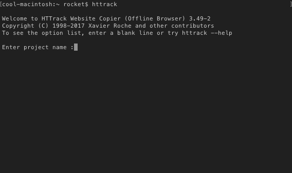
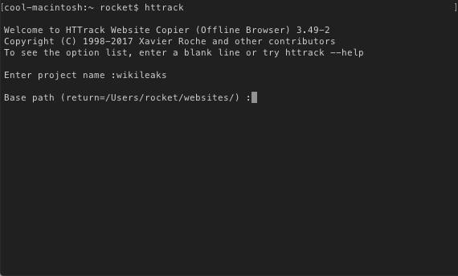
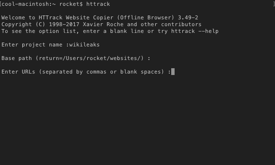
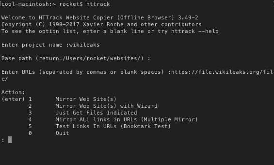
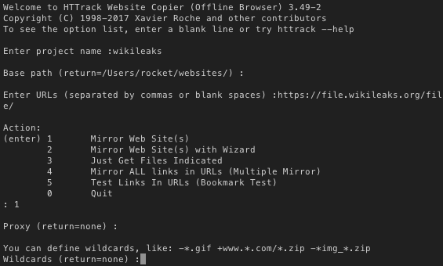
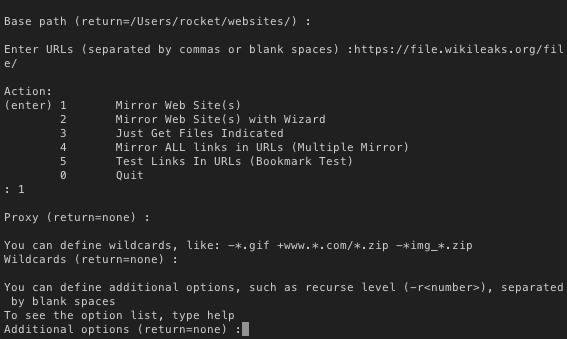
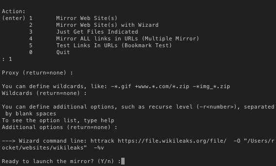

# How to Download the Entire Wikileaks Dump

In order to download the Wikileaks Dump, we are going to need to use a tool called [HTTrack](http://www.httrack.com/).

### HTTrack installation

You can follow the installation guide on the [Website](http://www.httrack.com/page/2/en/index.html)

### Dump Download

1. You need to start up HTTrack, open your terminal and type: `httrack`.

2. You need to enter the project name, this is going to be the name of the folder in which the files are nested in.

3. You now need to enter the basepath in which this folder is going to be nesed inside of. (you can leave it blank and press enter if you desire).

4. Next you need to enter the url of the wikileaks dump. The url is in the image below.

5. Next you will get a list of options which are methods in which you can download the website. Type `1` and press enter.

6. Next is the proxy option, if you want to use a proxy to download the files, you can type it in, if you aren't using a proxy, leave this field blank and press enter.

7. We are not going to want any wildcards, so just leave this field blank and press enter.

8. We do not need to enter any additional options, leave this field blank and press enter.

After you have completed these steps, the files are going to be downloaded into the base path that you defined in step `3`. Next navigate to `basepath/projectname` and double click on the `index.html` file. This will open a local version of the dump in your browser.